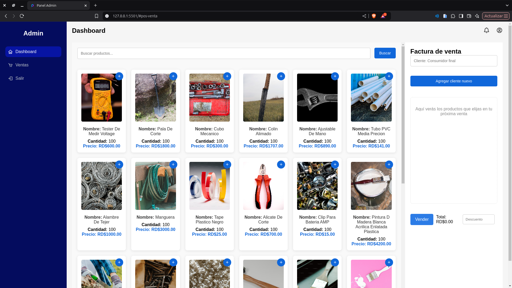
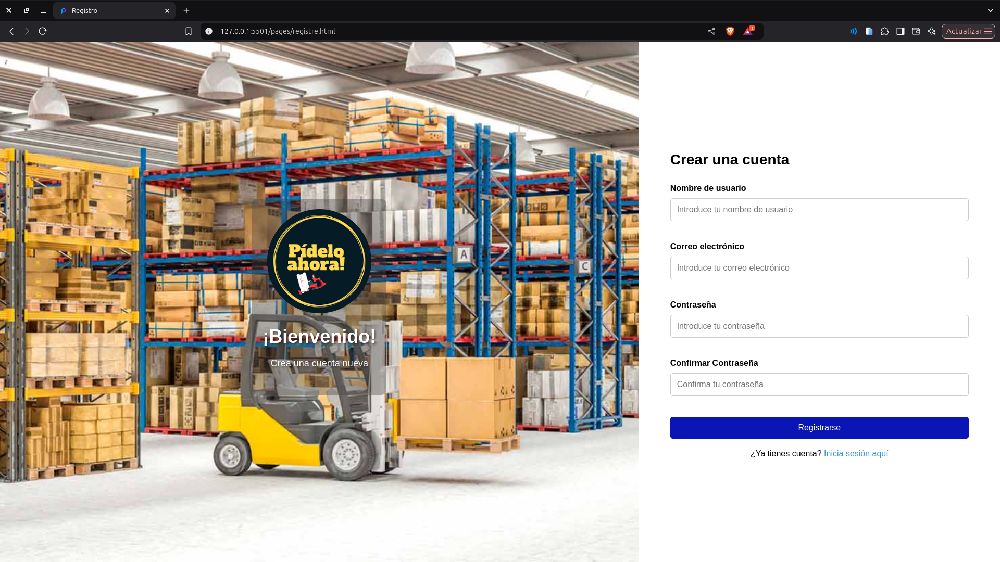

# Proyecto de Administración de ventas - Realizado por Oliver y Wilson

Este proyecto es un panel de Administración de ventas que incluye funcionalidades como estadísticas, punto de venta (POS), y autenticación de usuarios.

---

## Aportaciones de los Desarrolladores

### Parte de Oliver
- yo Olive Richetti: trabaje con las partes del proyecto:
-rejistro de usuario y el login,

# descripcion
la enpese por la parte supuestamente mas facil (chatgpt),
por ese lado solo consegui mucho trasnoche  y leer mucho para poder hacerlo que funcione y le pasaba el codigo y cada ves el mismo me mostraba mas error del que tenia,

# solucion 
borrar el codigo de (chatgpt), estudiar los slay y los codigos anteriores que ya aviamos dado, una ves me empesaron a funcionanr le pedia la supervision a mi compa%ero de equipo Wilson.

### Parte de Wilson
Yo, Wilson Espinal, trabajé en las siguientes áreas del proyecto:
- Diseño y lógica del módulo de ventas (POS).
- Implementación de la facturación, reducción de productos vendidos, códigos de descuento, gráficos y filtros por búsqueda de productos.
- Resolví problemas relacionados con la lógica del POS, como la modificación de un archivo existente (`productos.js`) sin necesidad de crear uno nuevo.
- Solucioné un inconveniente con la pérdida del proyecto en Git debido a malas prácticas.

---

## Funcionalidades

### 1. **Autenticación**
- **Archivos involucrados**: 
  - `js/login.js`
  - `pages/login.html`
  - `pages/registre.html`
- **Descripción**:
  - Permite a los usuarios iniciar sesión y registrarse.
  - Utiliza un token almacenado en `localStorage` para manejar sesiones.
  - Redirige al dashboard si el usuario ya está autenticado.

### 2. **Dashboard**
- **Archivos involucrados**:
  - `index.html`
  - `js/main.js`
  - `css/styles.css`
  - `css/dashboard.css`
- **Descripción**:
  - Página principal del panel de Administración de ventas.
  - Navegación entre módulos mediante hash (`#estadisticas`, `#pos-venta`).
  - Incluye una barra lateral con opciones de navegación.

### 3. **Estadísticas**
- **Archivos involucrados**:
  - `js/estadistica.js`
  - `index.html`
- **Descripción**:
  - Muestra estadísticas como productos vendidos, categoría más vendida e ingresos totales.
  - Incluye un gráfico de barras para visualizar datos.
  - Carga y muestra facturas con detalles de productos.

### 4. **Punto de Venta (POS)**
- **Archivos involucrados**:
  - `js/pos-ventas.js`
  - `index.html`
- **Descripción**:
  - Permite buscar productos, agregarlos a una factura y realizar ventas.
  - Incluye lógica para aplicar descuentos y actualizar inventario.
  - Maneja la creación de facturas y envía datos al backend.

---

## Tecnologías Utilizadas

- **Frontend**:
  - HTML, CSS, JavaScript
  - Librerías: Chart.js (para gráficos), Boxicons (para íconos)
- **Backend**:
  - Node.js con los siguientes módulos:
    - `bcryptjs` (para encriptación de contraseñas)
    - `nodemon` (para desarrollo)
    - `cors` (para manejo de CORS)
    - `express` (para crear el servidor)
    - `jsonwebtoken` (para manejo de tokens)

---

## Instalación y Configuración

1. Clona este repositorio.
2. Asegúrate de tener Node.js instalado.
3. Configura el backend para que corra en `http://localhost:3000`.
4. Abre el proyecto en Visual Studio Code y utiliza Live Server para ejecutar el frontend.

---

## Uso

1. Accede a la página de inicio de sesión en `/pages/login.html`.
2. Inicia sesión o regístrate como nuevo usuario.
3. Navega entre las secciones de estadísticas y punto de venta desde el dashboard.

---

## Contribuciones

Si deseas contribuir, por favor abre un issue o envía un pull request.

---

## Licencia

Este proyecto está bajo la licencia MIT.